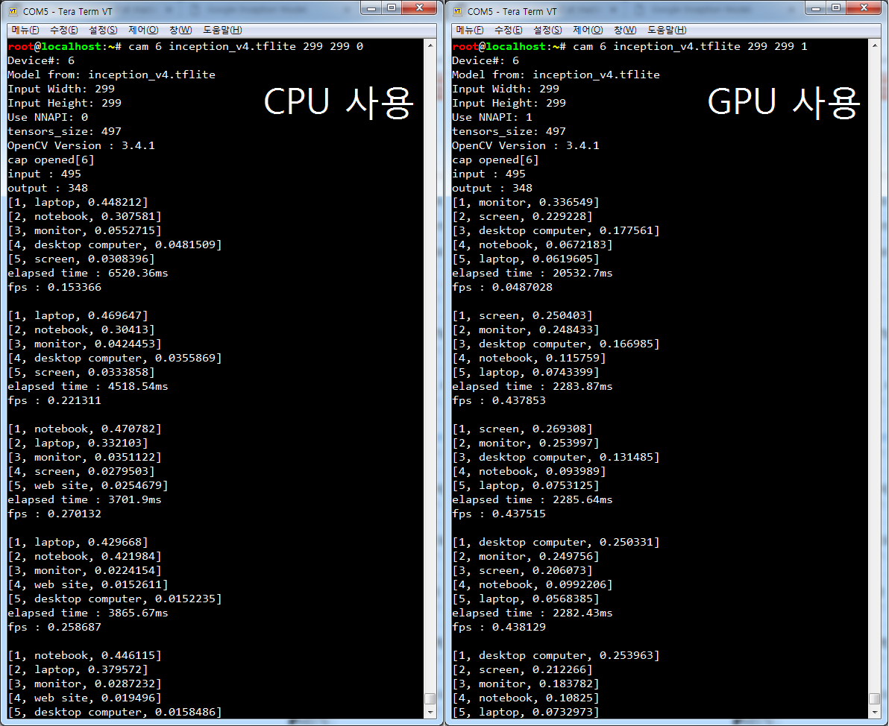
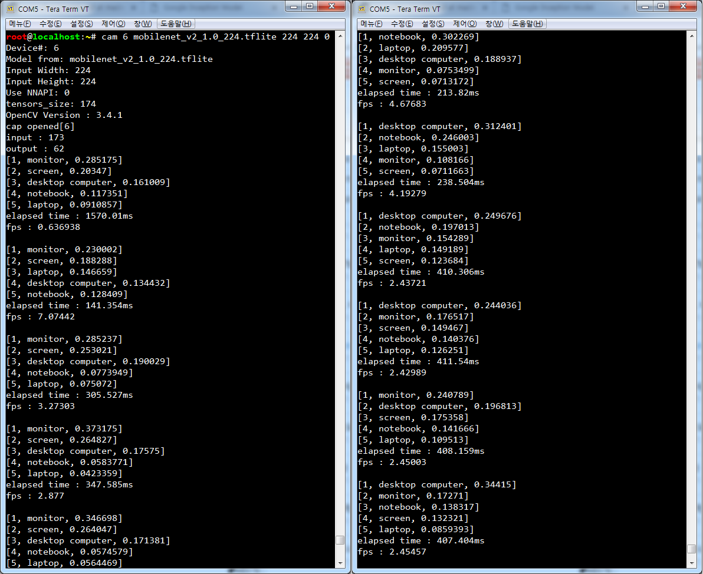
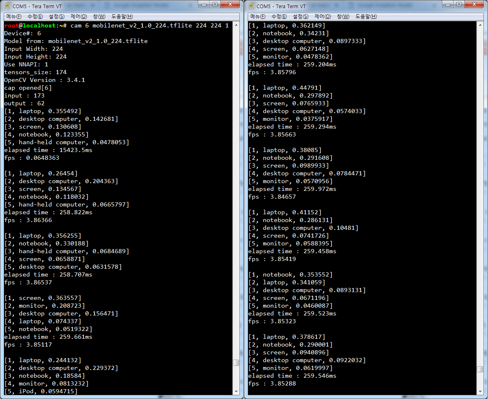

* 사용법
  * cam [webcam_device#] [model_filename] [input_width] [input_height] [use_NNAPI]
* 테스트 결과
  * inception_v4
    * CPU: 약 0.25 fps
    * GPU: 약 0.45 fps
    * GPU(NNAPI)를 사용했을 때가 확실히 빠르다.
      
  * mobilenet_v2_1.0_224
    * CPU: 약 2.5 ~ 4.5 fps
    * GPU: 약 3.85 fps
    * GPU(NNAPI)를 사용했을 때 안정적인 성능을 보임.
      
      
  * 깊은 모델일수록 GPU 사용 효과가 큰 듯 하다.
