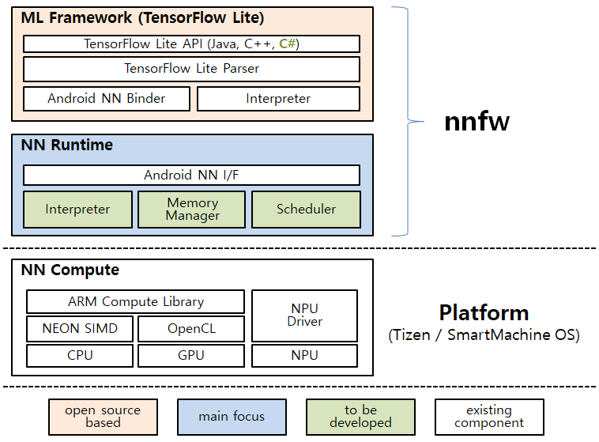

# Software High Level Design

## Design

### SW System Overall Architecture

The figure above illustrates the overall software stack including _nnfw_, which consists of ML
Framework and NN Runtime, and NN Compute.  Note that NN Compute is provided by the underlying
platform, and NN Runtime utilizes NN Compute for operation acceleration.  The next bullets describe
the role of each module and the background of design choice in the architecture.

1. ML Framework
   - Provide TensorFlow (TF) Lite on Tizen and SMP
      - We chose TF Lite as a standard ML framework in _nnfw_ for this year, since TF Lite is
        lightweight compared to other ML frameworks and its community is rapidly growing. We expect
        supporting TF Lite on Samsung's OS platforms would be beneficial to Samsung's diverse
        business areas and AI solutions.
   - Provide TF Lite C# API for Tizen .NET
      - Considering the existing TF Lite supports only C++ and Java API, C# API for TF Lite would
        be a great complement to TF Lite and natural extension for Tizen.
1. NN Runtime
   - Provide a common runtime interface, which is Android NN API
      - Android NN API (NN API for short) was selected for seamless integration with TF Lite. As
        long as our NN runtime provides NN API as an interface, TF Lite can link to our NN runtime
        without any modification.
      - Although we borrowed NN API as the runtime's interface, we plan to design and implement the
        runtime itself by ourselves. For the implementation, we would utilize compute libraries,
        e.g., ARM Compute Library (ACL), or device driver provided by NN Compute, for NN operation
        acceleration on CPU and GPU.
1. NN Compute
   - Provide computation acceleration library, such as ACL, or device driver for NPU
   - This layer will be provided by OS platform, and we will use the library or device driver as it
     is. We may request a specific version to the Platform team, but we don't expect we will be
     modifying the library.

### SW Structure Design

1. ML Framework
   - Provide TensorFlow (TF) Lite on Tizen and SMP
   - Provide TF Lite C# API for Tizen .NET
1. NN Runtime
   - Provide an implementation of Android NN API
   - Provide hardware acceleration of NN operations on the target platform

### SW Behavior Design

The figure above depicts the execution flow from the user input to the inference result output.

1. Input is a TF Lite model and is fed into TF Lite.  Application on Tizen or SMP may use C# or C++
   API to load and run the input model.
1. TF Lite determines whether the NN runtime is provided and supported on the platform or not.  If
   supported, it constructs an internal model from the TF Lite model for the NN runtime and passes
   the model to the runtime.  Otherwise, it invokes the internal interpreter, which runs on CPU, in
   order to perform inference with the given model.
1. If the NN runtime receives the model from TF Lite, it consults with the Execution Planner about
   how to decompose operations in the model and how to make an execution order of the operations.
   The Execution Planner also decides which backend between CPU fallback and ACL kernel backend
   could be better performing depending on operations.
1. When the NN runtime finishes the inference on CPU or GPU (or on both), it returns the output to
   TF Lite, which again delivers the output to the application.

### SW Interface Design

1. ML Framework
   - Java and C++ API of TF Lite will be provided as it is.
   - C# API will be defined as the project makes progress.
1. NN Runtime
   - Public API for NN Runtime is the same as Android NN API that is provided in [Android
   oreo-m2-release](https://android.googlesource.com/platform/frameworks/ml/+/oreo-m2-release).
   - The API is defined in
   [NeuralNetworks.h](../../include/NeuralNetworks.h).

